# SM·SI 사업부문 인력관리 시스템 명세서 (v1.8)

> 문서 목적: AI(Claude 등)에게 개발을 지시하기 위한 통합 명세서
> 변경 이력: v0.1 초안 → v0.2 추가 항목 반영 (단가·손익, 수급계획, 협력사, 알림 / 전사 1장) → v0.3 수행인력 주간 업무보고 입력 추가 (10장) → v0.4 배정 승인 제거, 이슈 작성만 → v0.5 알림 축소, WBS 제거 → v0.6 확인 사항 결정 → v0.7 SI 마일스톤 방식 WBS(C안) 반영 (10.4) → v0.8 수주확률 가중 미적용(Q9), 문서 정합성 정리 → v0.9 주간 업무보고 승인 절차 삭제(제출 = 확정), 이메일 로그인, 입사일·퇴사일 삭제, 다중 프로젝트 투입 설계(5.5) → v0.10 로그인 보조(비밀번호 보기·Caps Lock·초기 비밀번호 변경 강제, 비밀번호 재설정 요청, ID 찾기·문의) (2.1) → v0.11 사번 삭제 (내부 관리 번호 자동 부여·비표시, ID 찾기는 성명+연락처) → v0.12 인력 삭제 프로세스(3.3), 연락처 필수·상태 선택, 프로젝트 상태 제안/진행중/완료/중단(수주·실주 삭제) → v1.0 범위를 세 가지 핵심 목표로 재정리(1.1), 손익·협력사 계약·수급·알림은 차기 검토, 마일스톤 단순화(10.4), 프로젝트 주간보고·전사 One-Page 자동화(10.6, 11장) → v1.1 프로젝트 전 항목 수정(사업구분 포함, 변경 시 코드 재부여), 수주확률 삭제, 프로젝트별 투입현황 카드·상세 → v1.2 프로젝트 삭제(4.4), 프로젝트별 투입현황 카드는 진행중 프로젝트만 표시 → v1.3 로그인 아이디·초기 비밀번호를 이메일 주소로 통일(임시 비밀번호 발급 폐지), 시스템관리자 초기 아이디 toddkim@softbowl.co.kr → v1.4 주간 업무보고 입력 양식 변경: 프로젝트 카드 선택 → 투입시간·주간 업무 내용·이슈·차주 계획 순 입력, MD 일괄 입력(1/0.5) (10.2) → v1.5 전 화면에서 프로젝트는 프로젝트명으로 표시, 프로젝트 코드는 화면에서 생략(4.1) → v1.6 투입 배정 보드: 드래그 앤 드롭으로 프로젝트에 인력 추가·삭제·이동 (5.2.1) → v1.7 인원 구분(투입/투입 예정/대기) 단일 기준으로 전 화면 통일(5.6), 화면 값은 DB 실데이터만 사용(기준값 DB 저장, 데모 계정 버튼 제거) → **v1.8 가동률 재정의: 주 단위 인원 기준(그 주 배정 인원 ÷ 등록 인원, 기본 지난주), MD 기반 총/유상 가동률·저가동 기준 폐지 (5.3)**
> 표기: `[가정]` 작성자가 가정한 내용 / `[확인 필요]` 의사결정 필요

---

## 1. 📋 기획 이해 요약

SM(운영·유지보수), SI(구축), 내부 프로젝트 등에 투입되는 **자사·협력사 인력을 한 곳에서 관리**하고, 투입 계획·실적을 기반으로 **가동률·MM·손익을 자동 산출**하며, **향후 인력 수급을 예측**하고, **전사 주간 One-Page 리포트**를 생성하는 시스템.

### 1.1 v1.0 범위 — 세 가지 핵심 목표

이 시스템에서 얻고자 하는 것은 아래 세 가지이며, v1.0은 여기에 집중합니다.

| 목표 | 제공 기능 | 관련 장 |
|---|---|---|
| **① 프로젝트별 투입인력** | 투입 배정(다중 투입·과투입), 프로젝트별 투입인력 현황판(인력·역할·투입률·기간·계획/실적 MD), 인력 기준 보기, 월 타임라인, 프로젝트 MM | 5장 |
| **② 인력별 가동률** | 주간 가동률(지난주 기본, 배정 인원 ÷ 등록 인원), 조직·고용형태별, 12주 추이·이후 4주 예상, 미투입·대기·투입 예정·과투입 목록 | 5장 |
| **③ 주간보고 자동화** | 개인 주간 업무보고 1회 입력 → 프로젝트 주간보고 자동 취합(+PM 의견) → 전사 One-Page 자동 생성·확정·PDF | 10·11장 |

**차기 검토로 내린 항목** (명세는 참고용으로 남기며 v1.0에서는 개발하지 않음)

| 항목 | 장 | 비고 |
|---|---|---|
| 단가·손익 관리 | 6장 | 계약금액·손익 공개 여부 항목도 사용하지 않음 |
| 협력사 인력 계약·단가 | 7.2~7.3 | 협력사 마스터(7.1)와 인력의 협력사 연결은 유지 |
| 인력 수급 계획(소요인력) | 8장 | |
| 알림 | 9장 | 주의 사항은 전사 One-Page ③에서 확인 |
| SI 마일스톤 템플릿·버전·기준선·50/50 진척률 | (구 10.4) | **주요 마일스톤 입력** 방식으로 단순화 (10.4) |

### 요구사항 범위

| # | 요구사항 | 구분 | 시스템 반영 |
|---|---|---|---|
| 1 | 인력 정보 | 기본 | 인력 마스터 (소속·직급·기술등급·고용형태) |
| 2 | 프로젝트 코드 | 기본 | 사업구분별 코드 체계 (SM / SI / 내부 / 제안 / 기타) |
| 3 | 가동률·투입인력/기간·투입MM | 기본 | 투입 배정(계획) + 타임시트(실적) → 자동 집계 |
| 4 | 주간보고 One-Page | 기본 | **전사 1장**, 주차별 자동 생성 + PDF |
| 5 | 단가·손익 관리 | 추가 | 원가단가·청구단가 → 프로젝트/사업구분별 매출·원가·이익률 |
| 6 | 인력 수급 계획 | 추가 | 3~6개월 수요(수주예정 포함) vs 공급 → 과부족 예측 |
| 7 | 협력사(외주) 인력 관리 | 추가 | 협력사 마스터, 계약기간·단가, 투입 현황 |
| 8 | 알림 | 추가 | 철수 임박·MM 소진·협력사 계약 종료·장기 대기·진도 지연 |
| 9 | **주간 업무보고 (수행인력 입력)** | 추가 | 투입MD·실적·계획·진척률·이슈를 한 화면 입력 → 프로젝트 주간보고 → 전사 One-Page. SI는 마일스톤 기반 자동 진척률 |

### 전체 개념도

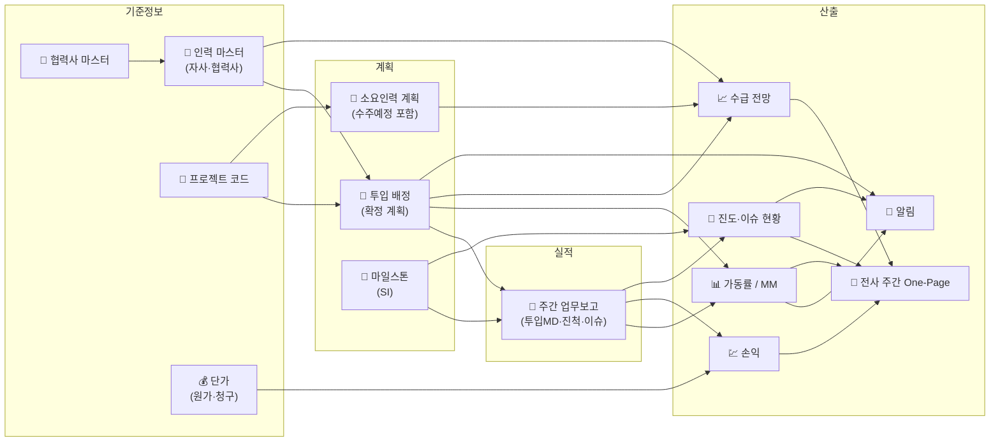

### 가정 사항

- `[가정]` 웹 기반 시스템, 사내망 사용 (PC 우선, 모바일은 조회 위주)
- **[확정]** 1MD = 8시간, 1MM = 22MD
- **[확정]** 주간 기준: 월~일. 개인 주간 업무보고는 **제출 마감 없음** (지난 주차도 언제든 작성·제출 가능)
- `[가정]` 전사 One-Page는 매주 월 12:00 그 시점까지 제출된 데이터로 자동 생성
- **[확정]** 주간 업무보고는 **승인 절차 없음** — 제출 = 확정, 제출 즉시 가동률·MM·손익 집계에 반영
- **[확정]** 로그인 ID는 **업무 이메일** (이메일 + 비밀번호)
- **[확정]** 원가단가는 사업부장/경영진·관리자만 조회. PM의 담당 프로젝트 손익 조회는 **프로젝트별 공개/비공개 설정**

---

## 2. 👥 역할 정의

| 역할 ID | 역할명 | 설명 | 예시 |
|---|---|---|---|
| R-01 | 투입인력 | 본인 정보 조회, 주간 업무보고(투입MD·실적·계획·이슈) 작성 | 자사 개발자, 상주 SM 인력, 협력사·프리랜서 인력 (로그인 허용) |
| R-02 | PM/PL | 투입 배정 등록, 마일스톤 관리(등록·완료 체크·일정 변경), 담당 프로젝트 주간보고 제출 현황·내용 확인, 이슈 취합 | 프로젝트 관리자, SM 파트장 |
| R-03 | 사업부장/경영진 | 전사 현황·손익·수급 조회, 주간보고 확정 | 사업본부장, 대표 |
| R-04 | 시스템관리자(PMO) | 인력·협력사·프로젝트·단가·기준값 관리 | 경영지원/PMO 담당자 |
| R-05 | 영업담당 `[가정]` | 수주예정 프로젝트 및 소요인력 등록 | 영업/제안 담당 |

### 2.1 로그인 · 계정 (v0.10)

메일 서버를 쓰지 않으므로(9장, 시스템 알림만) 재설정 링크 메일 대신 **시스템관리자가 처리**합니다.

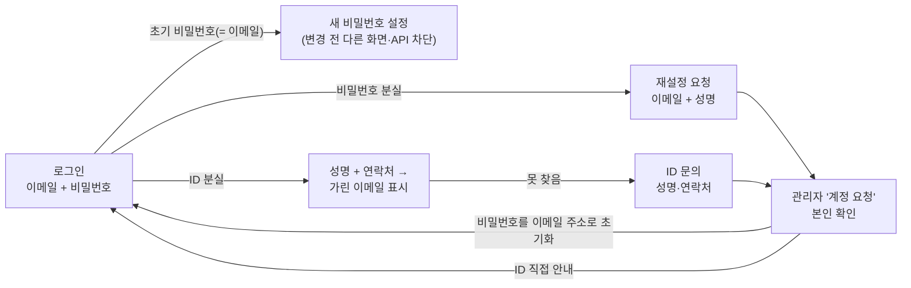

| 기능 | 내용 |
|---|---|
| 비밀번호 보기 | 비밀번호 입력란의 눈 아이콘으로 보이기/숨기기 |
| Caps Lock 경고 | 비밀번호 입력 중 Caps Lock이 켜져 있으면 경고 표시 |
| 초기 비밀번호 | **로그인 아이디 = 초기 비밀번호 = 업무 이메일 주소(소문자)**. 신규 등록·CSV 일괄 등록·관리자 비밀번호 초기화·재설정 요청 처리 모두 같은 규칙. 초기 비밀번호로 로그인하면 새 비밀번호(확인 입력 포함) 설정 전까지 다른 화면·API 이용 불가. 첫 로그인 전에 이메일을 수정하면 초기 비밀번호도 새 이메일로 바뀜 |
| 비밀번호 규칙 | 8자 이상, 영문·숫자 포함, 현재 비밀번호와 달라야 함. 입력 중 충족 여부·확인 일치 표시 |
| 비밀번호 재설정 요청 | 로그인 화면에서 이메일 + 성명 입력 → 관리자 처리 대기. 계정 존재 여부는 응답으로 알리지 않음 |
| ID(이메일) 찾기 | 성명 + 연락처(인력 정보에 등록된 번호, 숫자만 비교) 일치 시 일부를 가린 이메일 표시 (예: `gi****@example.com`). 연락처 미등록자는 ID 문의로 |
| ID 문의 | 찾지 못하면 성명·연락처·문의 내용을 남김 → 관리자가 직접 안내 |
| 관리자 '계정 요청' | 요청 목록(입력 정보와 일치하는 계정 표시), **비밀번호 초기화(이메일 주소로 되돌림)**·안내 완료·반려, 메뉴에 대기 건수 표시 |
| 남용 방지 | 로그인(IP+이메일 기준), 재설정 요청·ID 찾기·문의(IP 기준) 횟수 제한 |

### 데이터 접근 권한 매트릭스

| 데이터 | R-01 | R-02 | R-03 | R-04 | R-05 |
|---|---|---|---|---|---|
| 인력 기본정보 | 본인 | 조회 | 조회 | 관리 | 조회 |
| 투입 배정 / 가동률 | 본인 | 담당 프로젝트 | 전체 | 전체 | 조회 |
| 주간 업무보고(타임시트) | 본인 작성·제출 | 담당 조회 | 조회 | 조회 | – |
| 마일스톤 (SI) | 조회 | 담당 관리 | 조회 | 조회 | 조회 |
| 이슈 (주간보고 내) | 작성 | 조회·One-Page 반영 선택 | 조회 | 조회 | – |
| **원가단가** | – | – | 조회 | 관리 | – |
| **청구단가 / 손익** | – | 프로젝트별 공개 설정 시 담당분 조회 | 조회 | 관리 | 조회 `[가정]` |
| 협력사 계약·단가 | – | – | 조회 | 관리 | – |
| 소요인력 계획 | – | 조회 | 조회 | 조회 | 관리 |
| 주간보고 | – | 코멘트 입력 | 확정 | 조회 | – |

---

## 3. 인력 정보 (요구사항 1)

### 3.1 관리 항목

| 구분 | 항목 | 비고 |
|---|---|---|
| 기본 | 성명, 소속(본부/팀), 직급, 직무 | **사번은 관리하지 않음** (v0.11). 시스템 내부 관리 번호는 자동 부여되며 화면에 표시하지 않음 |
| 계정 | **업무 이메일 (필수·중복 불가, 로그인 ID)**, 비밀번호, 시스템 권한 | 이메일은 소문자로 저장 |
| 고용 | 고용형태 (정규직 / 계약직 / 프리랜서 / 협력사) | 협력사·프리랜서는 **협력사 마스터 연결 필수** (7장) |
| 기술 | 기술등급 (초급/중급/고급/특급), 주요 기술스택 | `[확인 필요]` KOSA 등급 체계 사용 여부 |
| 경력 | IT 경력 시작일 → 경력연수 자동 계산 | |
| 연락 | **연락처 (필수)** | 개인정보 최소 수집. ID(이메일) 찾기의 본인 확인에 사용 |
| 상태 | 재직 / 휴직 / 퇴사 — **선택 입력** (미지정은 재직으로 간주) | 입사일·퇴사일은 관리하지 않음. 퇴사자는 로그인 불가·목록 숨김, 이력 보존 |
| 집계 | 투입 대상 여부 | 관리·영업·경영진 등은 해제 → 가동률·대기 인원 집계 제외 |
| 원가 | 월 원가단가 (6장) | **별도 테이블·권한 분리 저장** |

> ⚠️ 주민등록번호, 주소 등 민감 개인정보는 수집하지 않음. 개인 연봉 원본은 저장하지 않고 **원가단가(등급·개인별 월 환산값)만 저장**하는 것을 권장.

### 3.2 인력 상태 (투입 관점)

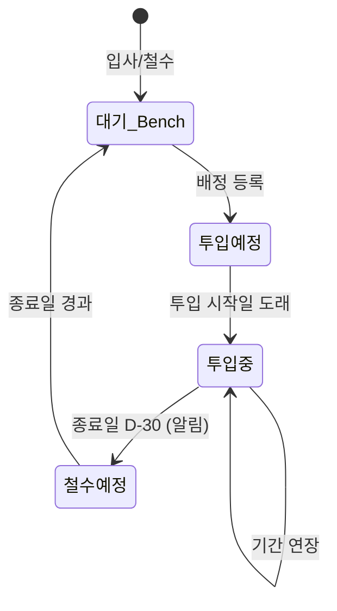

### 3.3 인력 삭제 (v0.12)

시스템관리자가 인력 상세에서 삭제합니다. 삭제 전 영향(연결된 이력·차단 사유)을 보여 주고 확인 체크 후 실행합니다.

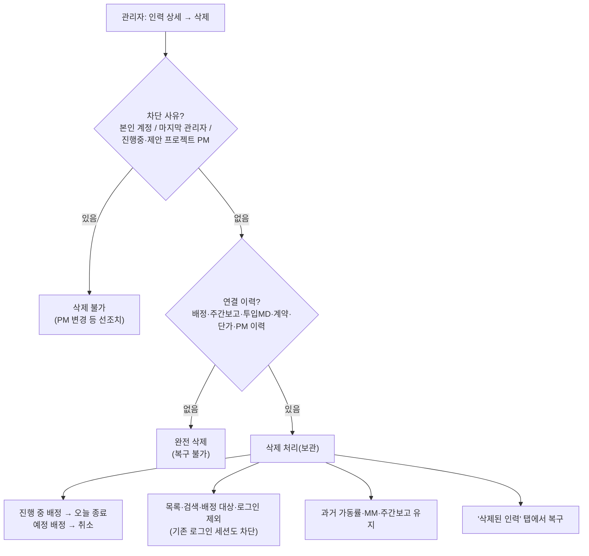

| 규칙 | 내용 |
|---|---|
| 권한 | R-04 시스템관리자 |
| 이메일 | 삭제 처리된 인력의 이메일은 계속 점유 — 같은 이메일로 신규 등록 시 복구 안내 |
| 집계 | 삭제·퇴사 인력은 해당 월 실적이 있을 때만 가동률에 포함 |

---

## 4. 프로젝트 코드 (요구사항 2)

### 4.1 코드 체계

**형식:** `{사업구분}-{연도}-{일련번호 3자리}` (자동 채번)

| 사업구분 | 코드 | 예시 | 설명 | 유상 가동 | 손익 산출 |
|---|---|---|---|---|---|
| SM | `SM` | SM-2026-001 | 운영·유지보수 (연단위, 상주/비상주) | O | O |
| SI | `SI` | SI-2026-003 | 구축·개발 프로젝트 | O | O |
| 내부 프로젝트 | `IN` | IN-2026-001 | 자체 솔루션 개발, 사내 시스템 | X | 원가만 |
| 제안/영업지원 | `PS` | PS-2026-004 | 프리세일즈·제안서 작업 | X | 원가만 |
| 기타 | `ETC` | ETC-2026-001 | 기타 업무 | X | 원가만 |

> **표시 규칙 (v1.5):** 프로젝트 코드는 시스템 내부 식별자로만 쓰고 **화면에는 프로젝트명만 표시**합니다 (목록·카드·선택 상자·보고서·안내 문구 모두). 코드가 필요하면 프로젝트명에 마우스를 올려 툴팁으로 확인합니다. 프로젝트 삭제 확인도 프로젝트명을 입력합니다.

### 4.2 비프로젝트 공통 코드 (타임시트용)

| 코드 | 명칭 | 가동률 반영 |
|---|---|---|
| `NP-EDU` | 교육 | 가용일에 포함, 비가동으로 처리 |
| `NP-LV` | 휴가 | 가용일에서 제외 |
| `NP-BENCH` | 대기 | 비가동 |
| `NP-ADM` | 일반관리 업무 | 비가동 |

### 4.3 프로젝트 관리 항목

| 항목 | 설명 |
|---|---|
| 프로젝트 코드 / 명 | 코드 자동 채번 |
| 고객사 | 예: ○○병원, ○○공사 |
| 계약형태 | 원도급 / 하도급 (원도급사명) |
| 사업기간 | 시작일 ~ 종료일 |
| 계약 MM | 계약서상 투입 MM |
| **계약금액** | 부가세 제외 금액 (손익 산출 기준) |
| **매출 인식 방식** | SM: 월정액 / SI: 투입MM × 청구단가 (확정) |
| **손익 공개 여부** | PM에게 담당 프로젝트 손익 공개 여부 (공개 / 비공개, 기본 비공개) — 관리자 설정 |
| PM | 담당 PM (R-02) |
| 상주 여부 | 상주 / 비상주 / 혼합 |
| 상태 | **제안** → 진행중 → 완료 / 중단 |
| 수정 | 시스템관리자는 **사업구분을 포함한 모든 항목 수정 가능**. 사업구분을 바꾸면 코드를 새 구분으로 다시 부여(같은 연도, 새 일련번호)하고 배정·주간보고·마일스톤 등 연결 데이터는 새 코드로 함께 옮김 |

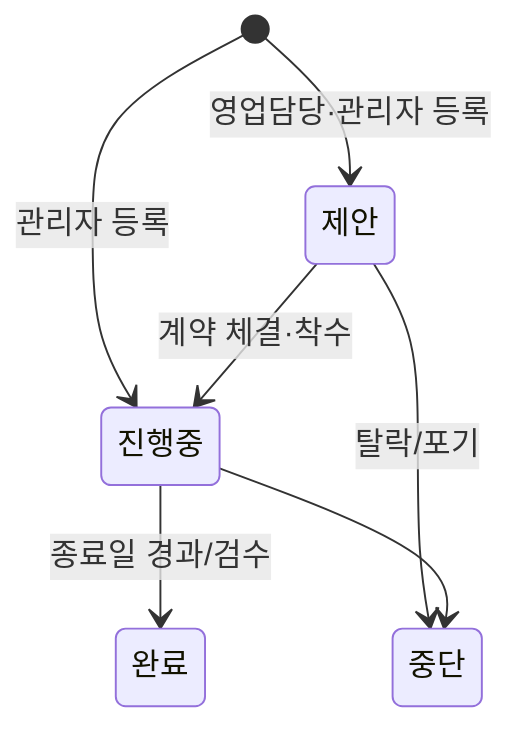

### 4.4 프로젝트 삭제 (v1.2)

시스템관리자가 프로젝트 수정 화면에서 삭제합니다. 이력을 남기려면 삭제 대신 상태를 '완료'·'중단'으로 바꿉니다.

| 규칙 | 내용 |
|---|---|
| 영향 확인 | 삭제 전 연결 데이터 건수 표시: 투입 배정, 투입 MD(행·합계), 주간보고 실적·계획·이슈, 마일스톤, 프로젝트 주간보고 |
| 이력 없음 | 바로 완전 삭제 |
| 이력 있음 | **프로젝트명을 직접 입력해 확인**한 뒤 연결 데이터와 함께 완전 삭제 (복구 불가). 투입 MD가 지워지므로 과거 가동률·MM 수치가 달라짐 |
| 유지되는 것 | 개인 주간 업무보고 자체와 다른 프로젝트의 투입 MD, 이미 확정한 전사 One-Page 스냅샷 |
| 대상 제외 | 비프로젝트 공통 코드(NP-*)는 삭제 불가 |

---

## 5. 가동률 · 투입인력 · 투입MM (요구사항 3)

### 5.1 데이터 흐름

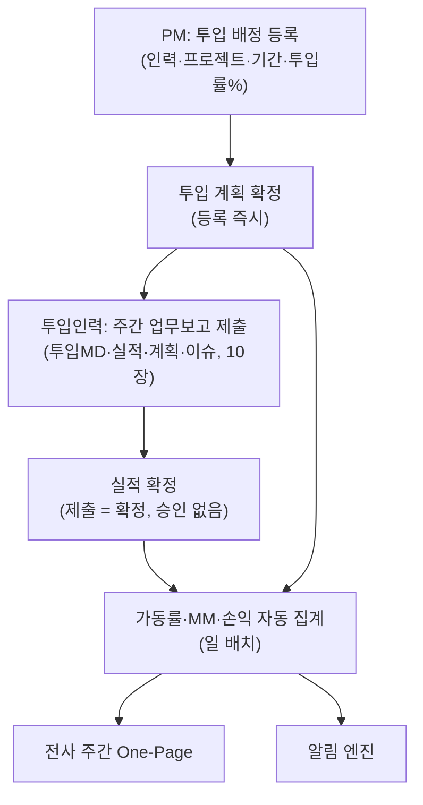

### 5.2 투입 배정(계획) 항목

| 항목 | 설명 |
|---|---|
| 인력 / 프로젝트 | 협력사 인력도 동일하게 배정 |
| 투입 역할 | PM, PL, 설계, 개발, 운영(SM) 등 |
| 투입 시작일 ~ 종료일 | |
| 투입률(%) | 100% = 전일 투입, 50% = 겸임 |
| 투입 구분 | 상주 / 비상주 |
| 청구단가 적용 | 프로젝트 청구단가표에서 역할·등급으로 자동 매핑 (6장) |

> 한 인력이 동일 기간 여러 프로젝트에 배정될 수 있으며, 투입률 합계 100% 초과도 **제한 없이 저장**됩니다. 초과분은 **과투입 %** 로 표기합니다 (예: 합계 130% → `과투입 +30%`). 인력 목록·타임라인·One-Page ④에 표시. **같은 프로젝트에 기간이 겹치는 중복 배정도 허용**합니다 (예: PL 50% + 개발 50%). 상세 규칙은 5.5.

### 5.2.1 배정 보드 — 드래그 앤 드롭 (v1.6)

투입 배정 화면의 기본 보기입니다. 한 프로젝트에 여러 인력을, 한 인력을 여러 프로젝트에 배정할 수 있습니다.

```
┌─ 인력 13명 ────────┐  ┌─ SNUBH_BestComm ── 2명·200% ─┐ ┌─ 두산보안포털 ── 1명·100% ─┐
│ [이름·소속 검색] □대기만│  │ PM ○○ · 2026-06-01 ~ 2027-01-11│ │ PM ○○ · ~ 2026-12-31       │
│ 김우종 BT실      대기 │─▶│ [한일남 100%·개발 ×][홍주원 100% ×]│ │ [이태우 100%·개발 ×]        │
│ 조현욱 BT실      100% │  │ [+ 인력 추가 ▾]               │ │ [+ 인력 추가 ▾]            │
│ 한일남 BT실      200% │◀─│        (칩을 인력 목록으로 끌면 빼기)                          │
└────────────────────┘  └──────────────────────────────┘ └──────────────────────────┘
```

| 동작 | 처리 |
|---|---|
| 인력 → 프로젝트 카드에 놓기 | 즉시 배정. 기본값: 시작일 = 오늘(프로젝트 시작 전이면 프로젝트 시작일), 종료일 = 프로젝트 종료일, 투입률 = 남은 투입률(100% − 현재 투입률, 남은 것이 없으면 100%), 역할 = 직무에서 추정 |
| 인력 칩 누르기 | 배정 수정 창 (역할·기간·투입률·상주 구분) |
| 인력 칩 → 인력 목록에 놓기 / × 버튼 | 프로젝트에서 빼기. 시작 전 배정은 **취소**, 진행 중 배정은 **오늘 날짜로 종료**(지난 실적 유지) |
| 인력 칩 → 다른 프로젝트 카드에 놓기 | 이동 (새 프로젝트에 배정 + 기존 프로젝트에서 빼기) |
| + 인력 추가 (선택 상자) | 끌기가 안 되는 터치 화면용 대체 수단 |
| 표시 | 프로젝트 카드: 인원·투입률 합계, 인력 칩: 투입률·역할·종료일, 예정 배정은 점선, 과투입은 붉게. 인력 목록: 오늘 투입률(n%·과투입), **예정 n%**(아직 시작 전인 배정), **대기**(현재·예정 배정 모두 없음), 미배정만 보기·검색 |
| 대상 | 진행중·제안 프로젝트, 투입 대상 인력. 같은 프로젝트에 이미 있는 인력은 다시 놓을 수 없음(칩에서 수정) |
| 권한 | 시스템관리자는 전체, PM은 담당 프로젝트 카드만 조작 가능 (그 외는 조회) |

기존 표 형식은 '목록' 탭에서 그대로 사용합니다 (종료·취소 배정 조회, 상세 조건 등록).

### 5.3 산식 정의

| 지표 | 산식 | 비고 |
|---|---|---|
| **가동률(주)** | 그 주에 프로젝트 배정이 있는 인원 ÷ 등록된 전체 인원(대상 인원) × 100 | **v1.8 재정의.** 주 단위 집계, 기본은 지난주 |
| 투입 MM | 투입 MD ÷ 22 | 확정 |
| 계획 MM | Σ(배정 기간 영업일 × 투입률) ÷ 22 | |
| MM 소진율 | 누적 실적 MM ÷ 계약 MM × 100 | 80%·100% 알림 |

가동률 기준 (v1.8)
- **투입 판단:** 투입 배정 기준. 그 주 영업일 중 하루라도 진행 중인 프로젝트 배정(취소 제외, 공통 코드 NP-* 제외)이 있으면 투입
- **인원수 기준:** 부분 투입(50% 등)도 1명. 투입률·투입 MD는 가동률에 반영하지 않음 (투입 MD는 참고 표시)
- **대상 인원:** 5.6의 대상 인원과 동일 (삭제·퇴사·휴직 제외, 투입 대상 인력)
- 이번 주 이후는 현재 배정 기준 예상치로 표시
- 기존 MD 기반 총/유상 가동률과 저가동 기준값은 폐지

**예시:** 등록 인원 14명 중 지난주 배정이 있는 인원 12명 → 가동률 **85.7%** (미투입 2명)

### 5.4 조회 화면 (v1.0)

**프로젝트별 투입현황** — 월 단위, PM은 담당 프로젝트만

| 탭 | 내용 |
|---|---|
| 프로젝트별 (카드) | **진행중 프로젝트만** 카드로 표시 (배정 인력이 없는 진행중 프로젝트도 0명으로 표시). 프로젝트마다 카드 1장: 프로젝트명·코드·상태, 고객사·PM, **시작일·종료일, 투입인력 수, 투입률 합계, 인력별 투입률**, **해당 월 소요 MD / 계획 MD**, 누적 소요 MD. 카드를 누르면 상세 페이지 |
| 프로젝트 상세 | 투입인력·투입률 합계·월 소요 MD·누적 소요 MD·마일스톤 요약, 인력별 역할·투입률·시작일·종료일·상태·계획/소요 MD 표, 주요 마일스톤. 배정 관리·주간보고·MM 현황으로 이동 |
| 인력별 | 인력마다 현재 투입률(과투입·대기 표시), 투입 프로젝트 목록(역할·투입률·기간), 계획/실적 MD |
| 월 타임라인 | 인력 × 6개월 투입률 표. 월 투입률 = Σ(배정 영업일 × 투입률) ÷ 그 달 영업일. 80~100% / 80% 미만 / 과투입 / 대기를 색으로 구분 → 배정 공백 시점 확인 |
| 요약 | 투입 프로젝트 수, 투입 인원, 다중 투입 인원, 과투입·대기 인원(오늘 기준) |

**가동률 (인력별 가동률)** — 주 단위, 기본 지난주

| 영역 | 내용 |
|---|---|
| 요약 | 가동률(전주 대비), 대상 인원, 투입, 미투입 |
| 추이 | 최근 12주 가동률 + 이후 4주 예상(배정 기준). 막대를 누르면 그 주로 이동 |
| 주의 인력 | 그 주 미투입, 대기·투입 예정(오늘 기준, 5.6), 과투입(그 주 배정 합계 100% 초과) |
| 조직별·고용형태별 | 투입/대상 인원, 가동률 |
| 인력별 | 투입 여부, 배정 프로젝트·투입률, 제출된 주간보고 투입 MD(참고), **최근 12주 투입 추이** |

**프로젝트 MM** — 프로젝트별 계약·계획·실적 MM, 소진율, 월별 계획 vs 실적

### 5.5 다중 프로젝트 투입 (v0.9)

한 인력이 같은 기간에 여러 프로젝트(SM·SI·내부·제안 등)에 나뉘어 투입되는 경우의 처리 규칙입니다.

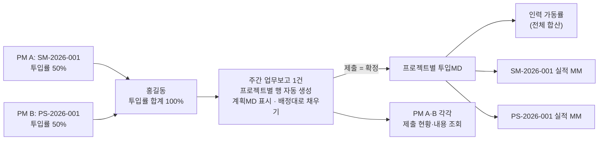

| 구분 | 규칙 |
|---|---|
| 배정 | 다른 프로젝트 동시 배정 허용, 같은 프로젝트 기간 중복 배정도 허용 (역할 분리 등). 투입률 합계 100% 초과는 저장 가능 + 과투입 % 표시 |
| 배정 등록 화면 | 인력·기간을 고르면 **같은 기간 다른 투입 목록**(프로젝트·역할·투입률·기간)과 기간 중 최대 투입률 합계, 과투입 여부를 미리 보여 줌 |
| 인력 목록 | 오늘 기준 투입률 합계 + 투입 프로젝트 수 (예: `100% · 2개 프로젝트`), 과투입 배지 |
| 주간 업무보고 ① | 해당 주 배정 프로젝트 행을 투입률 높은 순으로 자동 생성. 행마다 **계획 MD**(= 배정 기간 내 영업일 × 투입률, 같은 프로젝트 중복 배정은 합산) 표시 |
| 배정대로 채우기 | 버튼 1회로 프로젝트별 계획 MD를 0.5 단위로 반올림해 배정된 날짜에 0.5씩 돌아가며 배분. 하루 합계 1.0 이하 유지, 휴가 등 공통코드 입력은 먼저 차감. 투입률 합계 100% 초과 주는 높은 투입률 프로젝트부터 채움 → 수행인력이 실제에 맞게 수정 |
| 하루 합계 | 여러 프로젝트를 합쳐 **1일 1.0MD 초과 불가** (과투입이어도 실적은 1.0MD 안에서 나눔) |
| 실적·계획·이슈 | 작업 항목·이슈마다 프로젝트 지정. SM 프로젝트 항목은 업무유형·처리건수, SI는 진척률 |
| 확정 | 승인 절차 없음. 보고서 1건 제출 = 모든 프로젝트 분량 확정 |
| PM 조회 | 각 PM은 담당 프로젝트 기준 제출 현황(배정 인원 대비 제출 수, 미제출자)과 인력별 **이 프로젝트 MD / 계획 MD**, **동시 투입 중인 다른 프로젝트·투입률**을 조회. 보고서 상세는 전체 열람 |
| 가동률 | 인력 가동률은 모든 프로젝트 투입MD 합산. 인력별 행에 프로젝트별 MD 내역 표시 |
| 프로젝트 MM | 프로젝트별로 해당 프로젝트 MD만 집계 (계획 MM은 배정별 투입률 기준) |
| 손익 (6장) | 인력 원가는 프로젝트별 투입 MM 비율로 배분 |

### 5.6 인원 구분 기준 (v1.7)

대시보드·전사 One-Page·프로젝트별 투입현황·가동률·배정 보드가 **같은 기준**으로 인원을 셉니다.

| 구분 | 정의 |
|---|---|
| 대상 인원(총 인원) | 삭제·퇴사·휴직이 아니고 '투입 대상'인 인력 (상태 미지정은 재직으로 간주) |
| 투입 | 기준일에 진행 중인 배정이 있음 (과투입 = 기준일 투입률 합계 100% 초과) |
| **투입 예정** | 기준일에는 배정이 없지만 이후 시작하는 배정이 있음 (가장 빠른 시작일 표시) |
| 대기 | 진행 중·예정 배정이 모두 없음 |

- 기준일: 대시보드·투입현황·가동률·배정 보드는 오늘, 전사 One-Page는 해당 주 마지막 날(진행 중인 주는 오늘)
- 모든 수치는 DB의 인력·배정·주간보고에서 계산하며, 기준값(MM 환산 MD 등)도 DB(기준값 설정)에 저장된 값을 씁니다. 서버 시작 시 DB에 없는 기준값은 기본값으로 저장합니다.

---

## 6. 💹 단가 · 손익 관리 (추가 B) — ⏸ 차기 검토

> ⏸ v1.0 범위에서 제외 (1.1). 아래 내용은 차기 검토용 참고 명세입니다.

### 6.1 단가 구조

| 단가 | 적용 대상 | 설정 단위 | 관리자 | 이력 관리 |
|---|---|---|---|---|
| **원가단가** (월) | 인력 | 자사: 등급별 표준 또는 개인별 / 협력사: 계약단가 | R-04 | 적용 시작일 기준 이력 |
| **청구단가** (월) | 프로젝트 | 프로젝트 × 역할/등급 | R-04 | 계약 변경 시 이력 |

- **[확정]** 자사 원가단가 = 월 인건비 × (1 + 간접비율), 간접비율은 관리자 설정값
- 협력사 원가단가 = 협력사 계약 월단가 (7장에서 자동 연동)

### 6.2 손익 산식

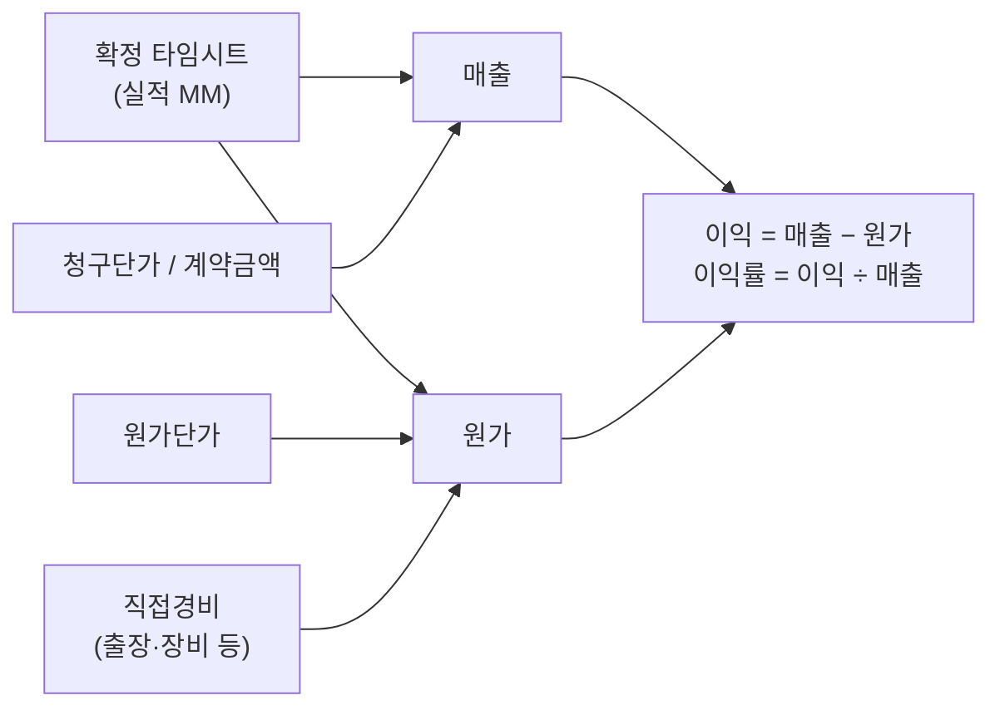

| 항목 | 산식 |
|---|---|
| 매출 (SM, 월정액) | 계약금액 ÷ 계약개월수 (월 균등 인식) |
| 매출 (SI) | Σ 실적 MM × 청구단가 |
| 인건비 원가 | Σ 실적 MM × 원가단가 |
| 직접경비 `[가정]` | 프로젝트별 월 수기 입력 |
| 이익 / 이익률 | 매출 − (인건비 원가 + 직접경비) / 이익 ÷ 매출 |
| 내부·제안 원가 | IN·PS·ETC 투입 원가 = 전사 간접비로 별도 집계 |

### 6.3 조회 화면

- 프로젝트별 손익: 월별 / 누계, 계획 대비 실적
- 사업구분별 손익: SM / SI 매출·원가·이익률 비교
- 인력별 수익 기여: 청구단가 − 원가단가 (마진) — R-03 전용
- 계획 손익(배정 기준) vs 실적 손익(타임시트 기준) 비교

---

## 7. 🤝 협력사(외주) 인력 관리 (추가 E)

### 7.1 협력사 마스터

| 항목 | 설명 |
|---|---|
| 협력사명, 사업자등록번호 | 법인 정보 |
| 담당자 / 연락처 | 협력사 측 창구 |
| 기본 계약기간 | 기본계약 시작 ~ 종료 |
| 상태 | 거래중 / 거래중지 |

### 7.2 협력사 인력 계약 — ⏸ 차기 검토

> ⏸ v1.0 범위에서 제외 (1.1). 아래 내용은 차기 검토용 참고 명세입니다.

| 항목 | 설명 |
|---|---|
| 협력사 / 인력 | 인력 마스터(고용형태 = 협력사·프리랜서)와 연결 |
| 투입 프로젝트 | 계약 대상 프로젝트 |
| 계약기간 | 시작 ~ 종료 (프로젝트 배정기간과 별도 관리) |
| 계약 월단가 | → 원가단가로 자동 연동 |
| 계약 MM / 금액 | 발주 기준 |
| 상태 | 계약중 / 종료 / 연장 |

### 7.3 기능 — ⏸ 차기 검토

> ⏸ v1.0 범위에서 제외 (1.1). 아래 내용은 차기 검토용 참고 명세입니다.

- 협력사별 투입 인원·MM·지급 예상액 조회
- 계약 종료 D-30 알림 (9장)

---

## 8. 🔭 인력 수급 계획 (추가 C) — ⏸ 차기 검토

> ⏸ v1.0 범위에서 제외 (1.1). 아래 내용은 차기 검토용 참고 명세입니다.

### 8.1 개념

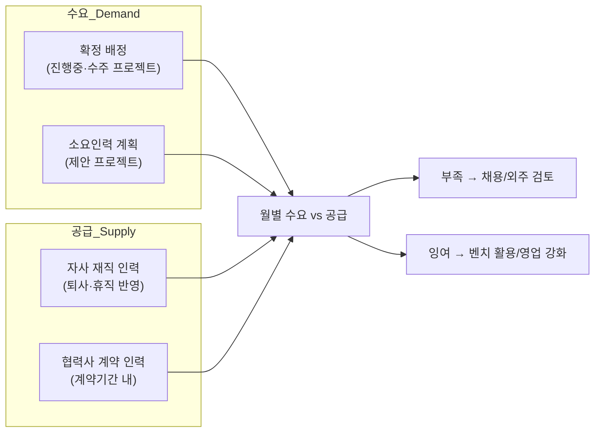

### 8.2 소요인력 계획 (영업담당 등록)

| 항목 | 설명 |
|---|---|
| 대상 프로젝트 | 상태 = 제안 / 진행중 |
| 필요 역할·등급 | 예: PL 고급 1명, 개발 중급 3명 |
| 필요 기간 | 시작월 ~ 종료월 |
| 투입률 | % |

### 8.3 산식

| 지표 | 산식 |
|---|---|
| 확정 수요(MM) | 월별 Σ 확정 배정 MM |
| 예상 수요(MM) | 월별 Σ 소요인력 MM (**수주확률 가중 미적용**, 화면에서는 확정/예상 수요를 분리 표시) |
| 공급(MM) | 월별 가용 인원 × 영업일 ÷ 22 |
| 과부족 | 공급 − (확정 수요 + 예상 수요) |

### 8.4 화면

- 향후 **3·6개월** 월별 막대그래프 (확정 수요 / 예상 수요 / 공급선)
- 역할·등급별 과부족 표 (예: "11월 PL 고급 1명 부족")
- 배정 종료 예정 인력 목록 → 다음 투입처 매칭 후보

---

## 9. 🔔 알림 (추가 H) — ⏸ 차기 검토

> ⏸ v1.0 범위에서 제외 (1.1). 아래 내용은 차기 검토용 참고 명세입니다.

| 코드 | 이벤트 | 발생 조건 | 수신자 | 주기 |
|---|---|---|---|---|
| AL-01 | 철수 임박 | 배정 종료일 D-30 / D-7 | PM, R-03, 본인 | 일 배치 |
| AL-03 | 계약 MM 소진 | 소진율 80% / 100% 도달 | PM, R-03 | 일 배치 |
| AL-04 | 협력사 계약 종료 | 계약 종료일 D-30 | R-04, PM | 일 배치 |
| AL-05 | 장기 대기 | 벤치 2주 이상 연속 | R-03 | 주 1회 |
| AL-06 | 진도 지연 | 진도 편차 < −10%p 또는 계획 종료일 경과 미완료 마일스톤 발생 | PM, R-03 | 주 1회 |

- 채널: **시스템 내 알림(벨)만** 사용 (이메일·메신저 발송 없음)
- AL-02(주간 업무보고 승인 지연)는 v0.9에서 승인 절차 삭제로 폐지 (코드 결번)
- 임계값(80%, D-30, 2주 등)은 관리자 설정(F-034)에서 변경 가능

---

## 10. 📝 주간 업무보고 — 수행인력 입력 (v0.3 추가)

### 10.1 개념: 한 번 입력 → 3단계 보고

수행인력은 **주 1회, 한 화면**에서 투입시간·실적·계획·이슈를 작성합니다. 이 데이터가 가동률/MM/손익, 프로젝트 진도, 프로젝트·전사 주간보고로 자동 연결되므로 **별도 타임시트·별도 보고서를 중복 작성하지 않습니다.**

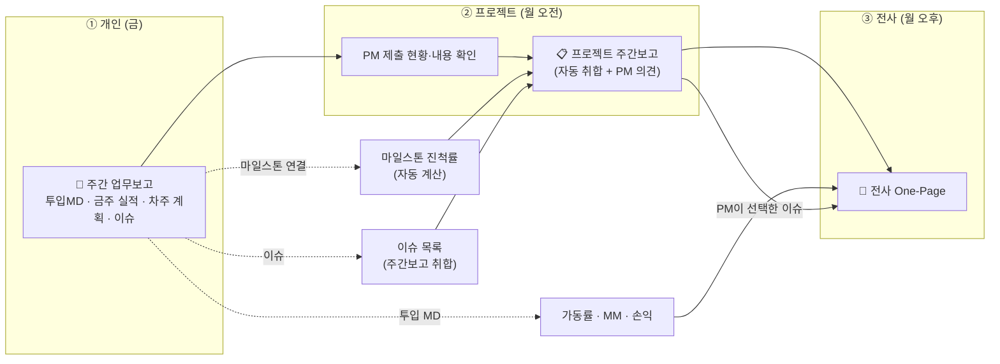

### 10.2 입력 화면 (와이어프레임, v1.4)

프로젝트 카드를 고른 뒤 그 프로젝트에 대해 **투입시간 → 주간 업무 내용 → 이슈 → 차주 계획** 순으로 입력합니다.

```
┌──────────────────────────────────────────────────────────────────────┐
│ 주간 업무보고   ◀ 2026-W40 (9/28~10/4) ▶     홍길동 (개발 / 중급)        │
│ 상태: [작성중]                                     [임시저장]  [제출]    │
├──────────────────────────────────────────────────────────────────────┤
│ ① 프로젝트 선택      [배정대로 채우기] [전주 계획 불러오기] [+ 프로젝트/공통코드] │
│ ┌───────────────┐ ┌───────────────┐ ┌───────────────┐               │
│ │▣ SI-2026-003   │ │ SM-2026-001    │ │ NP-LV 휴가     │  ← 카드 선택   │
│ │ ○○ 구축        │ │ ○○ 운영        │ │               │               │
│ │ 3 MD / 계획 3  │ │ 1.5 MD / 계획 2 │ │ 0.5 MD        │               │
│ │ 업무2·이슈1·계획1│ │ 업무1·이슈0·계획1│ │               │               │
│ └───────────────┘ └───────────────┘ └───────────────┘               │
│ 요일별 합계  월1  화1  수1  목1  금1  토-  일-   주간 합계 5 / 영업일 5    │
├──────────────────────────────────────────────────────────────────────┤
│ ② SI-2026-003 ○○ 구축                               [이 프로젝트 빼기]   │
│  투입시간 (MD)                 MD 일괄 입력 [전체 1] [전체 0.5] [지우기]   │
│   월 [1▾] 화 [1▾] 수 [0.5▾] 목 [0.5▾] 금 [-▾] 토 [-▾] 일 [-▾]  합계 3/계획 3│
│  주간 업무 내용                                          [+ 업무 추가]   │
│   작업 항목 │ 전주(%) │ 목표(%) │ 금주(%) │ 상세 내용 │ (지연 시 사유)     │
│  이슈 / 리스크                                            [+ 이슈 추가]   │
│   구분 │ 중요도 │ 지원요청 │ 내용 │ 조치계획/요청사항                      │
│  차주 계획                                                [+ 계획 추가]   │
│   작업 항목 │ 목표 진척률 │ 완료 예정일 │ 계획 내용                        │
├──────────────────────────────────────────────────────────────────────┤
│ ③ 특이사항 / 건의 (자유 기술)                                            │
└──────────────────────────────────────────────────────────────────────┘
```

| 요소 | 동작 |
|---|---|
| 프로젝트 카드 | 해당 주 배정 프로젝트가 자동으로 카드가 됨 (투입률 높은 순). 카드에 입력 MD / 계획 MD, 업무·이슈·계획 건수 표시. 공통코드(휴가·교육·대기·일반관리)도 카드로 추가 |
| 카드 선택 | 선택한 프로젝트의 입력 패널(②)이 열림. 공통코드는 투입시간만 입력 |
| MD 일괄 입력 | **전체 1 / 전체 0.5**: 선택한 프로젝트의 영업일을 한 번에 채움. 다른 프로젝트 입력과 합쳐 하루 1.0MD를 넘지 않도록 자동 조정(줄이거나 비움)하고 결과를 안내. **지우기**: 해당 프로젝트 MD 초기화 |
| 요일별 합계 | 전 프로젝트 합계를 요일별로 표시, 1.0 초과 시 강조 |
| 이 프로젝트 빼기 | 카드와 함께 그 프로젝트의 업무 내용·이슈·계획도 제거 (확인 후) |
| 전주 계획 불러오기 | 전주 '차주 계획'을 프로젝트별 '주간 업무 내용'으로 가져옴 (미작성 주차는 자동 이월) |

### 10.3 입력 항목 및 규칙

| 영역 | 항목 | 입력 규칙 |
|---|---|---|
| 투입시간 | 프로젝트/공통코드 × 요일별 MD | 0.5 단위, **1일 합계 ≤ 1.0 (초과 입력 불가)**. 배정된 프로젝트(해당 주 배정기간 내) 행 자동 생성, 행별 계획 MD 표시, '배정대로 채우기' 지원 (5.5) |
| 주간 업무 내용 (금주 실적) | 작업 항목(자유 입력), 상세 내용, 진척률(전주→금주), 상태, 지연사유 | 전주 '차주 계획' 자동 이월. 상태 자동 판정: 목표 이상 = 정상, 미달 = 지연(**사유 필수**), 100% = 완료 |
| 차주 계획 | 작업 항목(자유 입력), 계획 내용, 목표 진척률, 완료 예정일 | 최소 1건 (차주 전일 휴가 시 예외) |
| 이슈/리스크 | 구분, 중요도, 내용, 조치계획/요청사항, 지원요청 여부 | 해당 주 보고서에만 기록 (상태 추적·이월 없음). 없으면 생략 가능 |
| 특이사항 (보고서 공통) | 자유 기술 | 선택 |

> 작업 항목에 마일스톤을 연결하지 않습니다. 마일스톤은 PM이 프로젝트 단위로 관리합니다 (10.4). 주간 업무 내용·이슈·차주 계획은 선택한 프로젝트 카드에 속합니다.

**제출 전 검증 (위반 시 제출 불가 또는 경고)**

- 투입 MD 합계 + 휴가 ≠ 해당 주 영업일 → 경고
- 지연 항목의 사유 누락 → 제출 불가

**SM 인력 입력 방식** (확정)
SM은 작업별 진척률 대신 **업무유형(정기점검 / 요청처리 / 장애대응 / 개선개발 / 기타) + 처리건수 + 주요 내용**으로 입력합니다.

### 10.4 진도 관리 — 주요 마일스톤 입력 (v1.0)

프로젝트 진척은 **PM이 등록하는 주요 마일스톤**으로 관리합니다. 템플릿·버전·기준선·가중치 계산은 쓰지 않습니다.


| 항목 | 내용 |
|---|---|
| 입력 | 마일스톤명, 계획일(필수), 완료일, 비고(산출물·일정 변경 사유 등) |
| 권한 | 담당 PM·시스템관리자가 등록/수정/삭제/완료 체크. 조회는 로그인 사용자 |
| 상태 (자동) | 완료(완료일 있음) / **지연**(계획일이 지났는데 미완료) / 예정 |
| 진척률 | 완료 마일스톤 수 ÷ 전체 마일스톤 수 |
| 일정 변경 | 계획일을 직접 수정 (이력·버전 관리 없음, 사유는 비고에 기록) |
| 표시 | 프로젝트 주간보고 ① (트랙), 전사 One-Page ②(완료/전체·지연·다음 마일스톤), ③(지연 마일스톤) |
| 적용 대상 | 모든 프로젝트 선택 사항. 등록하지 않으면 진척 표시 없음 |

### 10.5 이슈 작성 (주간보고 내 기록)

이슈는 **주간보고의 한 항목으로 작성만 하고, 별도의 이슈 관리(담당 지정·상태 추적·조치기한 관리)는 하지 않습니다.** 매주 보고 시점의 이슈를 기록하고, 필요한 경우 다음 주 보고서에 다시 작성합니다.

| 항목 | 설명 |
|---|---|
| 프로젝트 | 이슈가 발생한 프로젝트 |
| 구분 | 이슈(발생) / 리스크(발생 가능) / 요청사항(고객·내부 지원 필요) |
| 중요도 | 상 / 중 / 하 |
| 내용 | 자유 기술 |
| 조치계획 / 요청사항 | 자유 기술 (선택) |
| 지원요청 | 체크 시 PM 주간보고 화면에서 강조 표시 |


> 이슈 목록은 주차별 보고서 기준으로 조회만 가능하며, 과거 주차 보고서를 열람하여 이력을 확인합니다.

### 10.6 PM 프로젝트 주간보고 (자동 취합 화면)

인력별 주간 업무보고(**제출분**)를 프로젝트 단위로 자동으로 모읍니다. PM은 종합 의견만 적고 확정합니다.

```
┌──────────────────────────────────────────────────────────────────────┐
│ 프로젝트 주간보고   [SI-2026-001 ▾]  ◀ 2026-W40 ▶     [작성 중 | 확정]   │
├───────────┬───────────┬───────────┬───────────┬──────────┬───────────┤
│ 제출 3/4명 │ 금주 8.5MD │ 누적 2.3MM │ 마일스톤   │ 지연 작업 │ 이슈 1건   │
│ 미제출: ○○ │ 계획 12MD  │ 소진 8.3%  │ 2/5       │ 0건      │ 상 1건    │
├───────────┴───────────┴───────────┴───────────┴──────────┴───────────┤
│ ① 주요 마일스톤  ✔분석 ✔설계 ○개발 ○테스트 ○이행  40%   [마일스톤 관리]   │
├──────────────────────────────────────────────────────────────────────┤
│ ② 인력별 실적/계획  이름·역할·투입률·제출상태·MD/계획MD                    │
│    금주 실적(진척률·상태·지연사유 / SM 업무유형·건수) │ 차주 계획          │
├──────────────────────────────────────────────────────────────────────┤
│ ③ 금주 이슈/리스크 (인력별 작성분 취합)        [☑ One-Page 반영 선택]     │
├──────────────────────────────────────────────────────────────────────┤
│ ④ PM 종합 의견 (입력)                          [의견 저장] [확정]        │
└──────────────────────────────────────────────────────────────────────┘
```

| 규칙 | 내용 |
|---|---|
| 대상 인력 | 해당 주 배정 인력 + 배정 없이 이 프로젝트에 MD를 입력한 인력 |
| 실시간 취합 | 확정 전에는 화면을 열 때마다 최신 제출 내용으로 다시 모음 (임시저장 상태의 보고서는 내용 미표시) |
| 확정 | PM이 확정하면 그 시점 내용을 스냅샷으로 고정. 확정 취소 후 수정 가능 |
| 이슈 선택 | PM이 체크한 이슈만 전사 One-Page ⑤에 올라감 (확정 후에는 변경 불가) |
| 권한 | 담당 PM·시스템관리자: 의견·확정·이슈 선택·마일스톤 관리 / 경영진: 조회 |

### 10.7 주간 일정

| 시점 | 작업 | 담당 |
|---|---|---|
| 금 (권장) | 개인 주간 업무보고 작성·제출 — **마감 없음**, 지난 주차도 작성·제출 가능 | R-01 |
| 제출 후 | 담당 프로젝트 제출 현황·내용 확인 (승인 절차 없음) | R-02 |
| 월요일 | 전사 One-Page 조회 — 조회 시점까지 **제출된** 데이터로 자동 집계 (별도 생성 작업 없음) | 시스템 |
| 월 오후 | 검토·편집·확정·배포 | R-03 |

- 제출 전에는 임시저장, 제출 후에도 작성자가 언제든 수정해 다시 제출 가능 ('수정 제출' — 저장과 검증을 함께 수행, 검증 실패 시 기존 제출 내용 유지)
- 늦게 제출·수정된 데이터는 가동률·MM·손익 집계(일 배치)에 즉시 반영. **이미 확정된 One-Page 스냅샷은 바뀌지 않으며**, 다음 주 One-Page의 누계에 반영

---

## 11. 📄 전사 주간 One-Page 리포트 (요구사항 4)

### 11.1 레이아웃 (A4 가로 1장, 전사 기준)

```
┌───────────────────────────────────────────────────────────────────────────┐
│ [전사 SM·SI 인력 주간 현황]  2026-W39 (9/21 ~ 9/27)     초안 | 확정: ○○○    │
├────────┬────────┬────────┬─────────┬─────────┬──────────┬────────────────┤
│ 총 인원 │투입 인원│대기 인원│가동률(주)│         │ 주간보고  │ 중요 이슈(상)   │
│ 7명    │ 6명    │ 1명    │ 85.7%   │ 6/7명   │ 제출 5/7 │ 1건            │
│자사·협력│        │        │ ▲14.3%p │         │          │                │
├────────┴────────┴────────┼─────────┴─────────┴──────────┴────────────────┤
│ ① 사업구분별 투입          │ ② 프로젝트별 투입인력 · MM                      │
│  구분 인원 금주MD 월누계MM │  프로젝트 │PM│투입인력(명단·투입률)│금주MD│      │
│  SM   3   6     1.55     │  누적/계약MM(소진율)│마일스톤(완료/전체·지연·다음)│ │
│  SI   4   8.5   2.18     │  │제출(n/m)                                    │
│ ③ 주의 사항                │                                              │
│  과투입 / 대기 / 미투입     │                                              │
│  30일 내 철수 예정          │                                              │
│  마일스톤 지연 / MM 80% 소진│                                              │
│  주간보고 미제출            │                                              │
├──────────────────────────┼──────────────────────────────────────────────┤
│ ④ 프로젝트 PM 의견          │ ⑥ 차주 계획 / 의사결정 필요 사항 (사업부장 입력) │
│ ⑤ 주요 이슈/리스크          │                                              │
│  (PM 선택 건 + 종합 의견)   │                                              │
└──────────────────────────┴──────────────────────────────────────────────┘
```

### 11.2 구성 요소

| 영역 | 내용 | 데이터 출처 | 자동/수동 |
|---|---|---|---|
| KPI 7종 | 총 인원(자사·협력사), 투입, 대기, 주간 가동률(배정 인원 ÷ 등록 인원, 전주 대비), 주간보고 제출, 중요 이슈 수 | 인력·배정·제출된 주간보고 | 자동 |
| ① 사업구분별 투입 | 구분별 투입 인원, 금주 MD, 월누계 MM | 배정 + 타임시트 | 자동 |
| ② 프로젝트별 투입인력·MM | 진행중 프로젝트별 PM, 투입인력 명단·투입률, 금주 MD, 누적/계약 MM·소진율, 마일스톤(완료/전체·지연·다음), 제출 현황 | 배정 + 타임시트 + 마일스톤 | 자동 |
| ③ 주의 사항 | 과투입, 대기, 투입 예정, 금주 미투입(배정 없음), 30일 내 철수 예정, 마일스톤 지연, 계약 MM 80% 이상 소진, 주간보고 미제출 | 집계 | 자동 |
| ④ 프로젝트 PM 의견 | 프로젝트 주간보고의 PM 종합 의견 | 프로젝트 주간보고 | 자동 |
| ⑤ 주요 이슈/리스크 | PM이 'One-Page 반영'으로 선택한 이슈 + 사업부장 종합 의견 | 주간보고 이슈 | 자동+수동 |
| ⑥ 차주 계획 | 차주 계획, 의사결정 필요 사항 | 사업부장 입력 | 수동 |

- 기준: 인원·배정은 해당 주 마지막 날(진행 중인 주는 오늘), 가동률은 해당 주 영업일 중 배정 여부(5.3), 투입 대상이 아닌 인력(관리·영업·경영진)은 제외
- 손익·수급 전망 영역은 v1.0에서 제외 (차기 검토)

### 11.3 생성·확정 흐름


- 확정 전에는 조회할 때마다 최신 제출 데이터로 다시 집계하므로 별도의 생성(배치) 작업이 없습니다.
- 확정 시점 집계값을 **스냅샷(JSON)** 으로 보관 → 이후 데이터 수정에 영향받지 않음. 확정 취소 후 다시 확정 가능
- 조회: PM·경영진·관리자·영업 / 입력·확정: 경영진·관리자
- PDF는 브라우저 인쇄 기능(A4 가로 인쇄 스타일)으로 저장

---

## 12. ✅ 기능 목록

### 투입인력 (R-01)
| ID | 기능명 | 설명 | 우선순위 |
|---|---|---|---|
| F-001 | 내 정보 조회 | 본인 인력정보·투입 이력을 조회할 수 있다 | 중간 |
| F-002 | 주간 업무보고 작성 | 프로젝트 카드를 선택해 투입MD·주간 업무 내용(진척률)·이슈·차주 계획을 프로젝트별로 작성·제출할 수 있다 | 높음 |
| F-003 | 제출 후 수정 | 제출한 보고서를 수정해 다시 제출할 수 있다 (승인 절차 없음) | 중간 |
| F-004 | 내 알림 ⏸ | (차기 검토) 본인 대상 알림 | – |
| F-007 | 로그인 보조 | 비밀번호 보기·Caps Lock 경고, ID(이메일) 찾기·문의, 비밀번호 재설정 요청, 초기 비밀번호(이메일 주소) 변경을 할 수 있다 | 높음 |
| F-005 | 전주 계획 이월 | 전주 '차주 계획'을 금주 실적 행으로 자동 불러올 수 있다 | 높음 |
| F-008 | MD 일괄 입력 | 선택한 프로젝트의 영업일 투입MD를 1 또는 0.5로 한 번에 입력할 수 있다 | 중간 |
| F-006 | 배정대로 채우기 | 다중 프로젝트 투입 시 배정 투입률 기준으로 요일별 투입MD를 자동 배분할 수 있다 | 중간 |

### PM/PL (R-02)
| ID | 기능명 | 설명 | 우선순위 |
|---|---|---|---|
| F-010 | 투입 배정 | 배정 보드에서 인력을 프로젝트로 끌어다 놓아 추가·삭제·이동하고, 기간·투입률을 수정할 수 있다 (등록 즉시 확정) | 높음 |
| F-011 | 주간보고 제출 현황 | 담당 프로젝트의 주차별 제출 현황(미제출자), 인력별 이 프로젝트 MD/계획 MD·동시 투입 프로젝트, 제출된 보고서를 조회할 수 있다 | 높음 |
| F-012 | 프로젝트 MM 현황 | 계획 vs 실적 MM, 소진율을 조회할 수 있다 | 높음 |
| F-013 | 프로젝트 주간보고 | 인력별 보고(투입MD·실적·계획·이슈)와 마일스톤이 자동 취합된 화면에서 종합 의견을 입력·확정할 수 있다 | 높음 |
| F-014 | 직접경비 입력 ⏸ | (차기 검토) | – |
| F-015 | 주요 마일스톤 관리 | 마일스톤(이름·계획일)을 등록·수정·삭제하고 완료 체크할 수 있다 | 높음 |
| F-016 | 이슈 취합·선택 | 인력별 작성 이슈를 조회하고 One-Page 반영 이슈를 선택할 수 있다 | 중간 |
| F-017 | 진도 현황 조회 | 마일스톤 진척률(완료/전체), 지연 마일스톤, 지연 작업을 조회할 수 있다 | 중간 |

### 사업부장/경영진 (R-03)
| ID | 기능명 | 설명 | 우선순위 |
|---|---|---|---|
| F-020 | 전사 대시보드 | 가동률·투입 현황 요약을 조회할 수 있다 | 높음 |
| F-021 | 프로젝트별 투입현황 | 프로젝트 카드(투입인력·투입률·기간·소요 MD)와 상세, 인력별 투입 프로젝트, 인력 × 월 타임라인을 조회할 수 있다 | 높음 |
| F-022 | 전사 One-Page | 자동 집계된 전사 주간 리포트에 종합 의견·차주 계획을 입력하고 확정·인쇄(PDF)할 수 있다 | 높음 |
| F-023 | 손익 조회 ⏸ | (차기 검토) | – |
| F-024 | 수급 전망 조회 ⏸ | (차기 검토) | – |

### 시스템관리자 (R-04)
| ID | 기능명 | 설명 | 우선순위 |
|---|---|---|---|
| F-030 | 인력 마스터 관리 | 인력 등록·수정·삭제(이력 없으면 완전 삭제, 있으면 보관·복구), 로그인 이메일 관리, 엑셀 일괄 업로드 | 높음 |
| F-031 | 프로젝트 코드 관리 | 프로젝트 등록, 코드 자동 채번, PM 지정, 계약 MM, 사업구분 포함 전 항목 수정, 삭제(연결 데이터 확인 후) (계약금액·매출인식·손익 공개는 차기 검토) | 높음 |
| F-032 | 단가 관리 ⏸ | (차기 검토) | – |
| F-033 | 협력사 관리 | 협력사 마스터 관리 (인력 계약·단가는 차기 검토) | 중간 |
| F-034 | 기준값 설정 | MM 환산일, 가동률·알림 임계값, 공휴일 캘린더 | 중간 |
| F-035 | 사용자·권한 관리 | 역할 부여, PM-프로젝트 매핑 | 중간 |
| F-037 | 계정 요청 처리 | 비밀번호 재설정 요청·ID 문의를 확인하고 비밀번호 초기화(이메일 주소)·안내 완료·반려할 수 있다 | 높음 |
| F-036 | 마일스톤 템플릿 관리 ⏸ | (v1.0에서 삭제 — 주요 마일스톤 직접 입력) | – |

### 영업담당 (R-05)
| ID | 기능명 | 설명 | 우선순위 |
|---|---|---|---|
| F-040 | 제안 프로젝트 등록 | 제안 상태 프로젝트를 등록·수정할 수 있다 | 높음 |
| F-041 | 소요인력 계획 등록 ⏸ | (차기 검토) | – |
| F-042 | 투입 가능 인력 조회 | 기간별 대기/철수 예정 인력을 조회할 수 있다 | 중간 |

---

## 13. 🗄️ DB 스키마 힌트

### 13.1 ERD

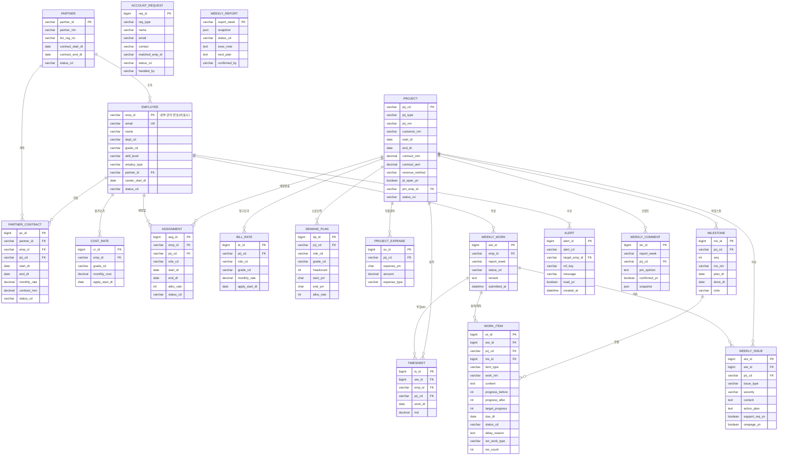

### 13.2 주요 코드·규칙

| 테이블 | 핵심 규칙 |
|---|---|
| `employee` | `emp_id`는 자동 부여 내부 관리 번호(사번 아님, 화면 비표시). `employ_type`: REG/CONT/FREE/PARTNER, PARTNER·FREE는 `partner_id` 필수. `email` UNIQUE·필수(로그인 ID, 소문자), `util_target` 가동률 집계 대상 여부, `must_change_pw` 초기 비밀번호 변경 강제, `deleted_at` 삭제 처리(보관) 일시, `status_cd` NULL 허용(미지정 = 재직), `phone` 필수. 입사일·퇴사일 컬럼 없음 |
| `project` | `prj_type`: SM/SI/IN/PS/ETC/NP, `revenue_method`: MONTHLY(SM)/MM(SI), `pl_open_yn`: PM 손익 조회 허용, `status_cd`: PROPOSAL(제안)/ACTIVE(진행중)/DONE(완료)/STOP(중단) |
| `cost_rate`, `bill_rate` | `apply_start_dt` 기준 이력, 조회 시 해당 월 유효 단가 적용. **접근 권한 분리** |
| `assignment` | `alloc_rate` 0~100, `status_cd`: PLANNED/ACTIVE/ENDED/CANCELED (날짜로 계산, 취소만 저장) — **승인 절차 없음, 등록 즉시 확정**. 동일 인력의 다른 프로젝트·같은 프로젝트 기간 중복 배정 허용 (5.5) |
| `weekly_work` | (emp_id, report_week) UNIQUE, `status_cd`: DRAFT/SUBMITTED — **제출 = 확정** (승인 절차 없음) |
| `timesheet` | `md` 0.5 단위, (emp_id, prj_cd, work_dt) UNIQUE, 1일 합계(전 프로젝트) ≤ 1.0, 상태는 `weekly_work`를 따름 (제출분만 집계) |
| `work_item` | `item_type`: ACTUAL/PLAN, 차주 PLAN → 다음 주 ACTUAL로 이월 복사, SM 프로젝트 항목은 `sm_work_type`·`sm_count` 사용. `ms_id`는 v1.0에서 사용하지 않음 |
| `weekly_comment` | 프로젝트 주간보고. (report_week, prj_cd) UNIQUE, `report_week`는 주차 값일 뿐 `weekly_report` FK 아님. PM 종합 의견, 확정 시 자동 취합 내용을 `snapshot`(JSON)으로 고정 |
| `milestone` | 주요 마일스톤. `plan_dt` 필수, `done_dt` 있으면 완료. 상태(완료/지연/예정)는 날짜로 계산, 진척률 = 완료 수 ÷ 전체 수 |
| `weekly_issue` | 주간보고의 하위 항목. `issue_type`: ISSUE/RISK/REQUEST, `severity`: H/M/L, 상태 컬럼 없음, `onepage_yn`은 PM만 변경 |
| `demand_plan` | (차기 검토) 소요인력 MM 그대로 예상 수요로 집계 |
| `alert` | `alert_cd`: AL-01, AL-03~AL-06 (AL-02 폐지), `ref_key`로 중복 발송 방지 |
| `account_request` | `req_type`: PW_RESET/ID_INQUIRY, `status_cd`: OPEN/DONE/REJECTED, `matched_emp_id`는 입력값과 일치하는 인력 (관리자 확인용) |
| `weekly_report` | 전사 One-Page. `report_week`: `2026-W40`, `status_cd`: DRAFT/CONFIRMED, 확정 시 `snapshot` 고정. `exec_note`(⑤ 종합 의견), `next_plan`(⑥ 차주 계획) |
| 집계 테이블 `[가정]` | `agg_util_monthly`, `agg_pl_monthly`, `agg_supply_monthly` (일 배치 생성) |
| 공통 컬럼 | `created_by`, `created_at`, `updated_by`, `updated_at` |

---

## 14. 🔌 API 명세 (요약)

| Method | Endpoint | 설명 | 접근 권한 | 기능 ID |
|---|---|---|---|---|
| POST | `/api/v1/auth/login` | 로그인 (이메일 + 비밀번호 → JWT, 변경 강제 여부 포함) | 전체 | – |
| PUT | `/api/v1/auth/me/password` | 비밀번호 변경 (변경 강제 해제된 새 토큰 발급) | 본인 | F-007 |
| POST | `/api/v1/auth/password-reset-request` | 비밀번호 재설정 요청 (로그인 전) | 공개 | F-007 |
| POST | `/api/v1/auth/id-lookup` | ID 찾기 (성명+연락처 → 가린 이메일) | 공개 | F-007 |
| POST | `/api/v1/auth/id-inquiry` | ID 문의 (로그인 전) | 공개 | F-007 |
| GET | `/api/v1/admin/account-requests` | 계정 요청 목록 / `count` 대기 건수 | R-04 | F-037 |
| POST | `/api/v1/admin/account-requests/{id}/reset-password` | 비밀번호를 이메일 주소로 초기화 | R-04 | F-037 |
| POST | `/api/v1/admin/account-requests/{id}/close` | 안내 완료 / 반려 | R-04 | F-037 |
| GET | `/api/v1/employees/{empId}/delete-impact` | 삭제 영향 (완전 삭제/보관, 배정·주간보고 건수, 차단 사유) | R-04 | F-030 |
| DELETE | `/api/v1/employees/{empId}` | 인력 삭제 (완전 삭제 또는 보관) | R-04 | F-030 |
| POST | `/api/v1/employees/{empId}/restore` | 삭제 처리된 인력 복구 | R-04 | F-030 |
| POST | `/api/v1/employees/{empId}/reset-password` | 관리자 비밀번호 초기화 (이메일 주소로 되돌림) | R-04 | F-030 |
| GET | `/api/v1/employees` | 인력 목록 (소속/상태/고용형태 필터) | R-02 이상 | F-030 |
| POST | `/api/v1/employees/import` | 엑셀 일괄 등록 | R-04 | F-030 |
| POST | `/api/v1/projects` | 프로젝트 등록 (자동 채번) | R-04, R-05(제안) | F-031, F-040 |
| GET | `/api/v1/projects/{prjCd}/delete-impact` | 삭제 영향 (연결 데이터 건수) | R-04 | F-031 |
| DELETE | `/api/v1/projects/{prjCd}` | 프로젝트 삭제 (이력이 있으면 `confirm`에 코드 필요) | R-04 | F-031 |
| GET/POST | `/api/v1/admin/rates/cost` | 원가단가 조회/등록 | R-03 조회, R-04 | F-032 |
| GET/POST | `/api/v1/admin/rates/bill` | 청구단가 조회/등록 | R-03 조회, R-04 | F-032 |
| GET/POST | `/api/v1/admin/partners` | 협력사 마스터 | R-04 | F-033 |
| POST | `/api/v1/admin/partners/{id}/contracts` | 협력사 인력 계약 등록 | R-04 | F-033 |
| POST | `/api/v1/assignments` | 투입 배정 등록 (즉시 확정, 과투입 %는 응답에 포함) | R-02 | F-010 |
| GET | `/api/v1/assignments/preview/overalloc` | 같은 기간 다른 투입 목록·투입률 합계·과투입 미리보기 | R-02 이상 | F-010 |
| GET | `/api/v1/weekly-works/{empId}/{week}` | 주간 업무보고 조회 (미작성 시 전주 계획 이월 초안, 프로젝트별 계획 MD 포함) | R-01 본인, R-02 담당 | F-002, F-005, F-006 |
| PUT | `/api/v1/weekly-works/{empId}/{week}` | 임시저장 (제출 전만) | R-01 본인 | F-002 |
| POST | `/api/v1/weekly-works/{empId}/{week}/submit` | 저장 + 검증 + 제출(= 확정), 제출 후 수정 제출도 동일 (위반 시 422, 기존 내용 유지) | R-01 본인 | F-002, F-003 |
| GET | `/api/v1/weekly-works/project-summary?week=` | 프로젝트별 제출 현황 (배정 인원·제출 수·미제출자) | R-02 이상 | F-011 |
| GET | `/api/v1/weekly-works/project/{prjCd}/{week}/status` | 인력별 제출 상태·이 프로젝트 MD/계획 MD·동시 투입 프로젝트 | R-02 담당 이상 | F-011 |
| PATCH | `/api/v1/projects/{prjCd}/weekly/{week}/issues/{id}/onepage` | One-Page 반영 선택/해제 (확정 전) | 담당 PM·R-04 | F-016 |
| GET | `/api/v1/projects/{prjCd}/weekly/{week}` | 프로젝트 주간보고 (자동 취합, 확정 시 스냅샷) | 담당 PM, R-03, R-04 | F-013, F-017 |
| PUT | `/api/v1/projects/{prjCd}/weekly/{week}/comment` | 종합 의견 저장 / 확정(스냅샷) / 확정 취소 | 담당 PM·R-04 | F-013 |
| GET/POST | `/api/v1/projects/{prjCd}/milestones` | 주요 마일스톤 목록(상태·진척률) / 등록 | 조회: 로그인 사용자, 등록: 담당 PM·R-04 | F-015, F-017 |
| PUT/DELETE | `/api/v1/projects/{prjCd}/milestones/{msId}` | 마일스톤 수정(완료 체크 포함) / 삭제 | 담당 PM·R-04 | F-015 |
| POST | `/api/v1/projects/{prjCd}/expenses` | 직접경비 입력 | R-02 | F-014 |
| POST | `/api/v1/demand-plans` | 소요인력 계획 등록 | R-05 | F-041 |
| GET | `/api/v1/stats/staffing?ym=` | 프로젝트별 투입인력 현황 (프로젝트 기준·인력 기준·월 타임라인) | R-02 이상 (PM은 담당) | F-021 |
| GET | `/api/v1/stats/utilization?week=` | 주간 가동률 (기본 지난주, 전주 대비·12주 추이·4주 예상 포함) | 전체 (본인/담당/전사) | F-020 |
| GET | `/api/v1/stats/utilization/{empId}/trend` | 인력별 최근 12주 투입 추이 | 본인, R-02 이상 | F-020 |
| GET | `/api/v1/stats/projects/{prjCd}/mm` | 계획 vs 실적 MM | R-02 이상 | F-012 |
| GET | `/api/v1/admin/stats/pl` | 손익 집계 (프로젝트/사업구분/인력) | R-03 이상 | F-023 |
| GET | `/api/v1/stats/supply-forecast?months=3` | 수급 전망 (3/6개월) | R-03, R-05 | F-024, F-042 |
| GET | `/api/v1/alerts/me` | 내 알림 목록 | 전체 | F-004 |
| GET | `/api/v1/reports/weekly/{week}` | 전사 One-Page 조회 (확정 전: 실시간 집계, 확정 후: 스냅샷) | R-02, R-03, R-04, R-05 | F-022 |
| PUT | `/api/v1/reports/weekly/{week}` | ⑤ 종합 의견·⑥ 차주 계획 저장 | R-03, R-04 | F-022 |
| POST | `/api/v1/reports/weekly/{week}/confirm` · `/unconfirm` | 확정(스냅샷) / 확정 취소 | R-03, R-04 | F-022 |

- 단가·손익 API는 `/admin/` 경로로 분리하여 권한 검사 일원화
- 에러 코드: 400 / 401 미인증 / **403 권한 없음** (비밀번호 변경 필요 시 `PW_CHANGE_REQUIRED`) / 404 / 409 충돌(이메일 중복, 제출된 보고서 임시저장) / 422 제출 검증 실패 / 429 요청 횟수 초과 / 500

---

## 15. 범위 결정 기록

| 항목 | 결정 |
|---|---|
| B. 단가·손익 관리 | ⏸ 차기 검토 (v1.0에서 제외) |
| C. 인력 수급 계획 | ⏸ 차기 검토 (v1.0에서 제외) |
| E. 협력사 인력 관리 | 협력사 마스터만 반영 (7.1), 인력 계약·단가는 ⏸ 차기 검토 |
| H. 알림 | ⏸ 차기 검토 (주의 사항은 One-Page ③) |
| 주간보고 범위 | ✅ 전사 1장 (11장) |
| 수행인력 주간 업무보고 | ✅ 반영 (10장) — 타임시트 통합, 작업별 진척률·이슈 작성 포함 |
| WBS | 주요 마일스톤 입력으로 단순화 (10.4) — 템플릿·버전·기준선·50/50 진척률 삭제 |
| 알림 (과투입·미제출·협력사 계약기간 초과·인력 부족 전망) | ❌ 제외 — 6종만 유지 (9장) |
| 투입 배정 승인 절차 | ❌ 미적용 — PM 등록 즉시 확정 |
| 주간 업무보고 승인 절차 | ❌ 삭제 (v0.9) — 제출 = 확정, AL-02 폐지 |
| 다중 프로젝트 투입 | ✅ 반영 (5.5) — 같은 프로젝트 중복 배정 허용, 계획MD 표시·배정대로 채우기 |
| 이슈 관리 (담당·상태·기한 추적) | ❌ 미적용 — 주간보고 작성·취합만 |
| D. 스킬·자격 검색 | ⏸ 차기 검토 (기술스택 필드만 인력 마스터에 유지) |
| F. 상주 보안관리 | ⏸ 차기 검토 |
| G. SM 서비스 실적(SR) | ⏸ 차기 검토 |
| I. 근태/그룹웨어 연동 | ⏸ 차기 검토 (휴가는 타임시트 `NP-LV`로 입력) |

---

## 16. ❓ 확인 사항 결정 결과

| # | 질문 | 결정 | 반영 위치 |
|---|---|---|---|
| Q1 | MM 환산 기준일 | ✅ 1MM = 22MD | 1장, 5.3 |
| Q2 | 교육 시간 가동률 분모 | ✅ 포함 (가용일에서 차감 안 함) → v1.8 인원 기준 가동률로 대체(Q45) | 4.2, 5.3 |
| Q3 | SI 매출 인식 방식 | ✅ 투입MM × 청구단가 | 4.3, 6.2 |
| Q4 | PM 손익 공개 | ✅ 프로젝트별 공개/비공개 선택 | 2장, 4.3 |
| Q5 | 자사 원가단가 | ✅ 인건비 + 간접비율 | 6.1 |
| Q6 | 협력사 정산 지원 | ✅ 불필요 | 7장 |
| Q7 | 협력사·프리랜서 로그인 | ✅ 허용 | 2장 |
| Q8 | 과투입 처리 | ✅ 제한 없이 저장, 과투입 % 표기 | 5.2, 11장 |
| Q9 | 수주확률 가중 | ✅ 미적용 — 소요인력 MM 그대로 예상 수요 집계, 확정/예상 분리 표시 | 8.3 |
| Q10 | 알림 채널 | ✅ 시스템 알림만 | 9장, 11.3 |
| Q11 | 사용자 규모·운영 환경 | ✅ 명세 범위 외 | – |
| Q12 | 기존 데이터 이관 | ✅ 불필요 | – |
| Q13 | SM 인력 실적 입력 | ✅ 업무유형 + 처리건수 | 10.3 |
| Q14 | 주간보고 제출 마감 | ✅ 마감 없음, 지난 주차 입력 허용 | 10.7 |
| Q15 | 프로젝트 진척률 산정 | (Q32로 대체) 주요 마일스톤 입력 방식 | 10.4 |
| Q16 | 1일 1.0MD 초과 입력 | ✅ 불허 | 10.3 |
| Q17 | 이슈 고객 공유 | ✅ 내부 전용 | 10.5 |
| Q18 | 주간 업무보고 승인 | ✅ 승인 절차 삭제, 제출 = 확정 | 5.1, 10장 |
| Q19 | 로그인 ID | ✅ 업무 이메일 + 비밀번호 | 3.1 |
| Q20 | 입사일·퇴사일 | ✅ 관리하지 않음 (상태만 관리) | 3.1 |
| Q21 | 같은 프로젝트 기간 중복 배정 | ✅ 허용 | 5.2, 5.5 |
| Q22 | 다중 투입 MD 입력 보조 | ✅ 계획MD 표시 + 배정대로 채우기 | 5.5, 10.3 |
| Q23 | 진행 중인 달 가동률 분모 | ✅ 오늘까지의 영업일 → v1.8 인원 기준 가동률로 대체(Q45) | 5.3 |
| Q24 | 비밀번호 재설정 방식 | ✅ 관리자에게 요청 → 비밀번호를 이메일 주소로 초기화 (메일 발송 없음) | 2.1 |
| Q25 | ID 문의 | ✅ 성명+연락처로 가린 이메일 조회, 못 찾으면 관리자 문의 | 2.1 |
| Q27 | 사번 | ✅ 관리하지 않음. 내부 관리 번호 자동 부여·비표시 | 3.1 |
| Q28 | 이력 있는 인력 삭제 | ✅ 삭제 처리(보관) — 목록·로그인 제외, 이력 유지, 복구 가능. 이력 없으면 완전 삭제 | 3.3 |
| Q29 | 인력 연락처 / 상태 | ✅ 연락처 필수, 상태 선택 | 3.1 |
| Q31 | v1.0 범위 | ✅ 프로젝트별 투입인력·인력별 가동률·주간보고 자동화에 집중. 손익·협력사 계약·수급·알림은 차기 검토 | 1.1 |
| Q32 | 프로젝트 진척률 | ✅ PM이 주요 마일스톤(이름·계획일) 입력, 완료 체크. 진척률 = 완료 수 ÷ 전체 수 | 10.4 |
| Q33 | One-Page 생성 방식 | ✅ 배치 생성 없이 조회 시 실시간 집계, 확정 시 스냅샷 | 11.3 |
| Q34 | 프로젝트 수정 범위 | ✅ 사업구분 포함 전 항목 수정, 사업구분 변경 시 코드 재부여 | 4.3 |
| Q35 | 수주확률 | ✅ 항목 삭제 | 4.3 |
| Q36 | 프로젝트 삭제 | ✅ 연결 데이터 확인 후 완전 삭제 (이력 있으면 코드 입력 확인) | 4.4 |
| Q37 | 투입현황 카드 범위 | ✅ 진행중 프로젝트만 | 5.4 |
| Q38 | 초기 비밀번호 | ✅ 로그인 아이디와 같은 이메일 주소, 첫 로그인 시 변경 강제 (임시 비밀번호 발급 폐지) | 2.1 |
| Q39 | 시스템관리자 초기 아이디 | ✅ toddkim@softbowl.co.kr (초기 비밀번호도 같은 값) | 2.1 |
| Q40 | 주간 업무보고 입력 양식 | ✅ 프로젝트 카드 선택 → 투입시간·주간 업무 내용·이슈·차주 계획 순, MD 일괄 입력(1/0.5) | 10.2 |
| Q41 | 프로젝트 표시 | ✅ 전 화면 프로젝트명 표시, 코드는 생략(툴팁) | 4.1 |
| Q42 | 투입 배정 방식 | ✅ 배정 보드에서 드래그 앤 드롭 (추가·삭제·이동), 목록 화면 병행 | 5.2.1 |
| Q43 | 대기 인원 구분 | ✅ 투입 / 투입 예정 / 대기를 전 화면 같은 기준으로 표시 | 5.6 |
| Q44 | 데이터 출처 | ✅ 화면 값은 모두 DB 실데이터·DB 기준값에서 계산 (하드코딩·데모 버튼 제거) | 5.6 |
| Q45 | 가동률 정의 | ✅ 주 단위, 그 주 프로젝트 배정이 있는 인원 ÷ 등록된 전체 인원 (투입 배정 기준, 부분 투입도 1명, 기본 지난주). MD 기반 총/유상 가동률 대체 | 5.3 |
| Q30 | 프로젝트 상태 | ✅ 제안 / 진행중 / 완료 / 중단 (영업중 → 제안, 수주·실주 삭제) | 4.3 |
| Q26 | 로그인 보조 | ✅ 비밀번호 보기, Caps Lock 경고, 초기·임시 비밀번호 변경 강제 | 2.1 |
